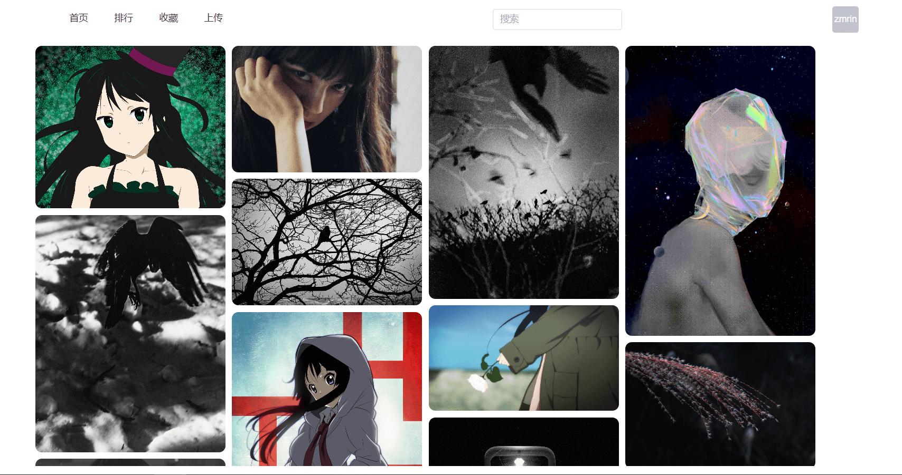
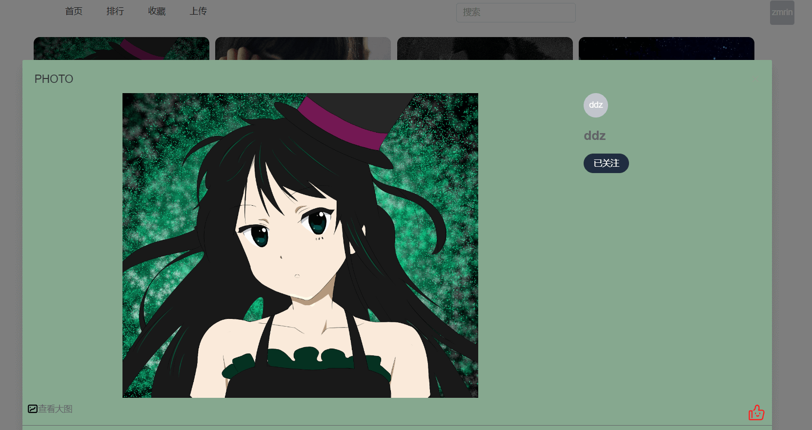
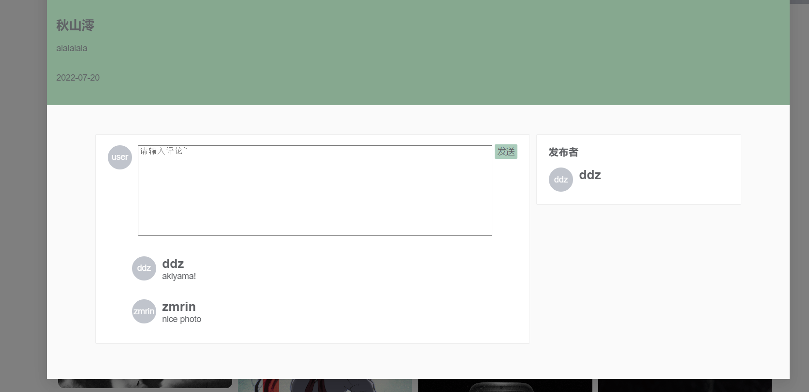
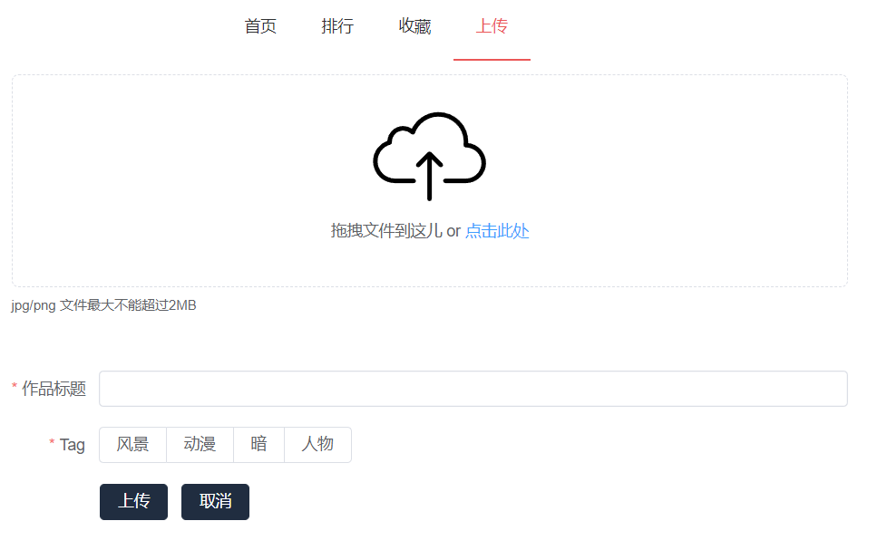
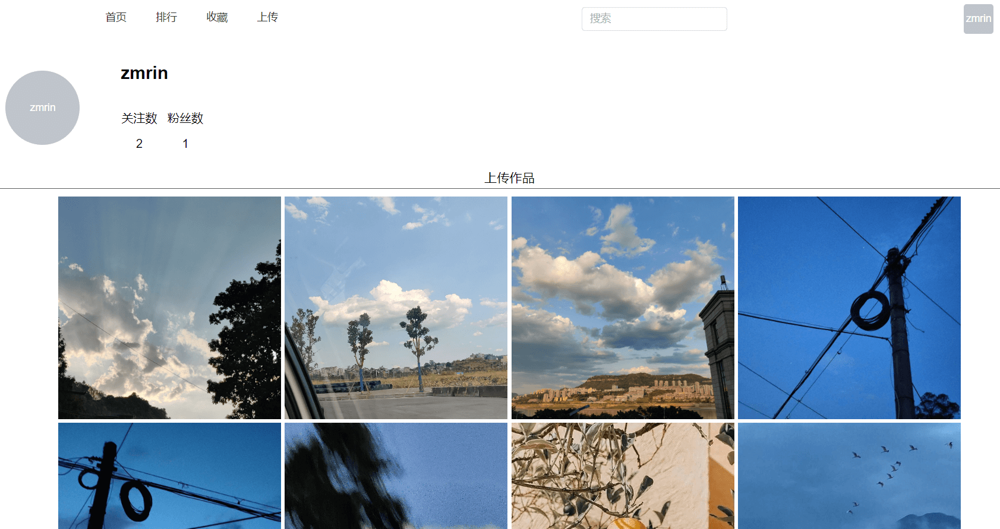
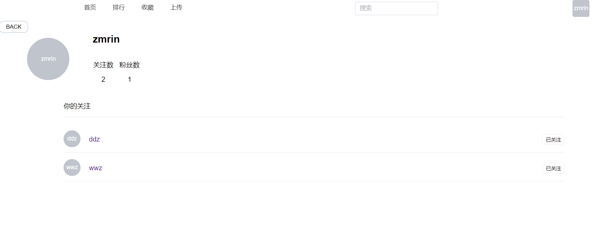

# wphoto-client

wphoto vue3 version

- 首页



- 页面适配

  

- 点开图片详情



- 评论区域



- 上传页面



- 收藏喜欢页


- 个人主页



- 关注/粉丝



## Project setup

```shell
npm install
```

## Compiles and hot-reloads for development

```shell
npm run serve
```

## Compiles and minifies for production

```shell
npm run build
```
